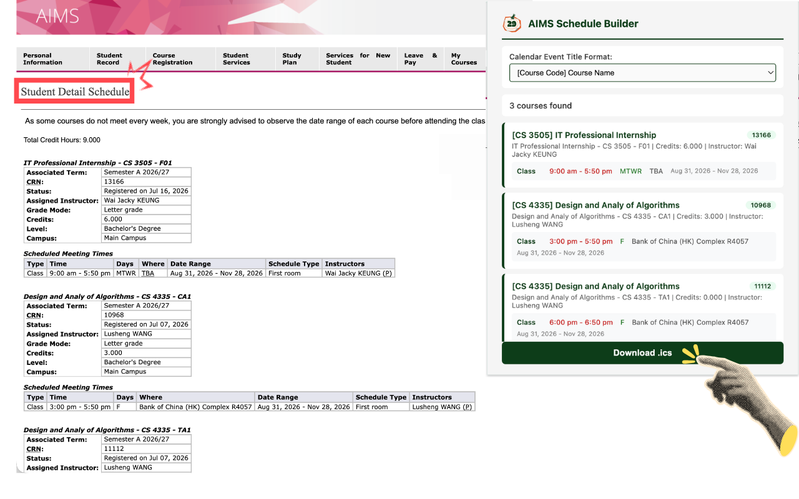

# AIMS Schedule Builder

A Chrome extension that instantly converts your CityU AIMS timetable into a downloadable calendar file (.ics). Works with Google Calendar, Apple Calendar, Outlook, and more.

## Installation

1. Install the extension from the [Chrome Web Store](https://chromewebstore.google.com/detail/aims-schedule-builder/lminikmdjenhpamoigpjoejaidmlpjee).
2. (For developers) Alternatively, load it manually:
   * Download or clone this repository.
   * Open Chrome and go to `chrome://extensions/`.
   * Enable Developer mode.
   * Click Load unpacked and select the extension folder.

## How to Use

1. Log in to [CityU AIMS](https://banweb.cityu.edu.hk).
2. Navigate to **Student Detail Schedule** (go to Course Registration > Weekly Schedule > click View Detail Schedule).
3. Click the **AIMS Schedule Builder** icon in your Chrome toolbar.
4. Review your courses and meeting times in the popup.
5. Click **Download .ics** to save your calendar file.
6. Import the downloaded .ics file into your preferred calendar app (Google Calendar, Apple Calendar, Outlook, etc.).

---

This is a third-party extension created by a CityU student for personal convenience. It is not affiliated with or endorsed by City University of Hong Kong.